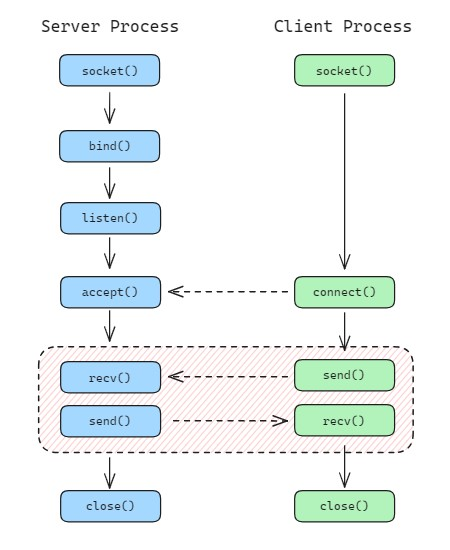

# Linux Socket #

Sockets are communication endpoints in Linux that enable processes to communicate with each other, either on the same device or across a network.

The typical sockets use case is the client-server network interaction model.



<br>

## Socket Address ##
Socket addresses are defined by the **address family** and the **address of socket in the internet**.

TCP/IP support only one addressing family (or domain), which denoted by AF_INET in C, the address is specified by the **IP address** and **port number**.

```c
#include <netint/in.h>

/* abstract socket address, 16 bytes as total */
struct sockaddr {
    sa_family_t sa_family;
    char        sa_data[14];
}

/* used for IPv4 address family */
struct sockaddr_in {
    sa_family_t    sin_family; /* 2 bytes, address family: AF_INET */
    in_port_t      sin_port;   /* 2 bytes, port in network byte order */
    struct in_addr sin_addr;   /* 4 bytes, internet address */
    unsigned char sin_zero[8]; /* 8 bytes, padding */
};

struct in_addr {
    uint32_t       s_addr;     /* address in network byte order */
};
```
There are few functions which used for handle network byte order:

```c
#include <netinet/in.h>
#include <arpa/inet.h>

/* ----------- Local ==> Network ----------- */

/* Change IP address from numbers-and-dots to network byte order*/
int inet_aton(const char *cp, struct in_addr *inp);

/* Change Port from host byte order to network byte order */
uint16_t htons(uint16_t hostshort);

/* ----------- Network ==> Local ----------- */

/* Change IP address from network byte order to numbers-and-dots */
char *inet_ntoa(struct in_addr in);

/* Change Port from network byte order to host byte order*/
uint16_t ntohs(uint16_t netshort);
```

<br>

## Server Process Function ##

### 1. Create a socket ###
```socket()```  creates  an  endpoint  for  communication  and returns a file descriptor that refers to that endpoint.
```c
int socket(int domain, int type, int protocol);
```

### 2. Add address to a socket ###

When a socket created with ```socket()```, it exists in a name space (address family), but no address assigned to it.

```bind()``` used to assign the addresss to the socket. Traditionally, this opertaion is called "assigning a name to a socket".

```c
int bind(int sockfd, const struct sockaddr *addr, socklen_t addrlen);
```

### 3. Listen for connections on a socket ###

```listen()``` marks the socket (created by ```socket()``` ) as a passive socket, which will be used to accept incoming connection requests using ```accept()```.

```c
int listen(int sockfd, int backlog);
```

### 4. Accept a connection on a socket ###

```accept()``` extracts the first connection request on the queue of pending connections for the listening socket, create a new connected socket, and return a new file descriptor referring to that socket.
```c
int accept(int sockfd, struct sockaddr *addr, socklen_t *addrlen);
```

### 5. Exchange message in a connected socket ###

```recv()``` used to receive messages from a socket.

The only difference between ```recv()``` and ```read()``` is the presence of flags. With a zero flags argument, ```recv()``` is generally equivalent to ```read()```.
```c
ssize_t recv(int sockfd, void *buf, size_t len, int flags);
```

```send()``` used to send messages to a socket.

The only difference between ```send()``` and ```write()``` is the presence of flags. With a zero flags argument, ```send()``` is generally equivalent to ```write()```.

```c
ssize_t send(int sockfd, const void *buf, size_t len, int flags);
```

### 6. Close a socket ###

As a socket is a file descriptor, so we can use ```close()``` to close it.

```c
int close(int fd);
```

<br>

## Client Process Function ##

### 1. Create a socket ###

Same as above.

### 2. Connect to the server side  ###

```connect()``` connects the socket (created by ```socket()``` ) to the address specified by ```addr```.

```c
int connect(int sockfd, const struct sockaddr *addr, socklen_t addrlen);
```


### 3. Exchange message in a connected socket ###

Same as above.

### 4. Close a socket ###

Same as above.