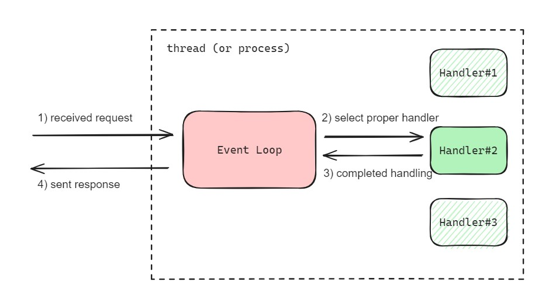
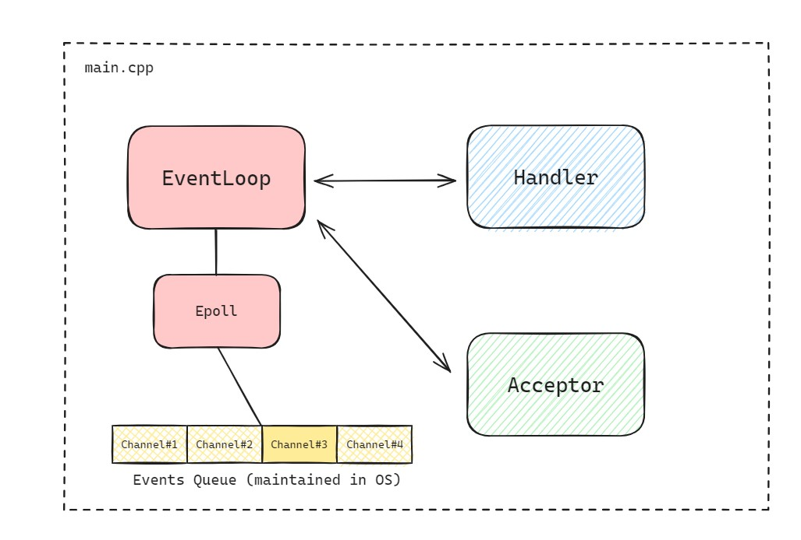

# Reactor Pattern #

The **reactor software design pattern** is an **event handling strategy** (relying on event-drive) that can concurrently handle multiple requests. The pattern's key component is an **event loop** which running in a single thread or process, and used for:
+ demultiplexing incoming requests
+ dispatching them to the correct handler

<br>



With its balance of simlicity and scalability, the reactor has became a central architectural element in serveral server applications and software frameworks for networking, especially in handling **C10k problem**.

> **C10K problem**: the problem of optimizing network sockets to handle alarge number of clients at the same time.

## Reactor Components ##

A reactive application consists of serverl moving parts and will reply on some support mechanisms:

### Handle ###

An identifier and interface to a specific request, this will often take the form of a socket, file descriptor, or similar mechanism.

It's ``` Class Channel ``` in my practice.

### Demultiplexer ###
An event notifier that can efficiently monitor the status of a handle, then notify the status change. Traditionally this roll was filled by the ```select()``` system call.

It's ``` Class Epoll ``` in my practice.

### Dispatcher ###
The actual event loop of the reactive application, this component maintains the registry of valid event handlers, then invokes the appropriate handler when an event is raised.

It's ``` Class EventLoop ``` in my pratice, but I don't implement callback for registering event handler.

### Event Handler ###
Also known as a request handler, this is the specific logic for processing one type of service request. The reactor pattern suggests registering these dynamically with the dispatcher as callback for greater flexibility.

It's ```void Handler::listenHandler(Channel*)``` or ```void Handler::upperHandler(Channel*)``` in my pratice.

### Event Handler Interface ###
An abstract interface class, representing the general properties and methods of an event handler.

It's ```void Handler::HandlerEntry(Channel*)``` in my pratice, it is used for Handler instace to select proper Event Handler.


